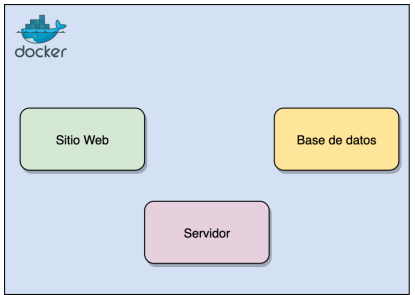
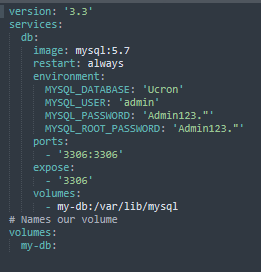
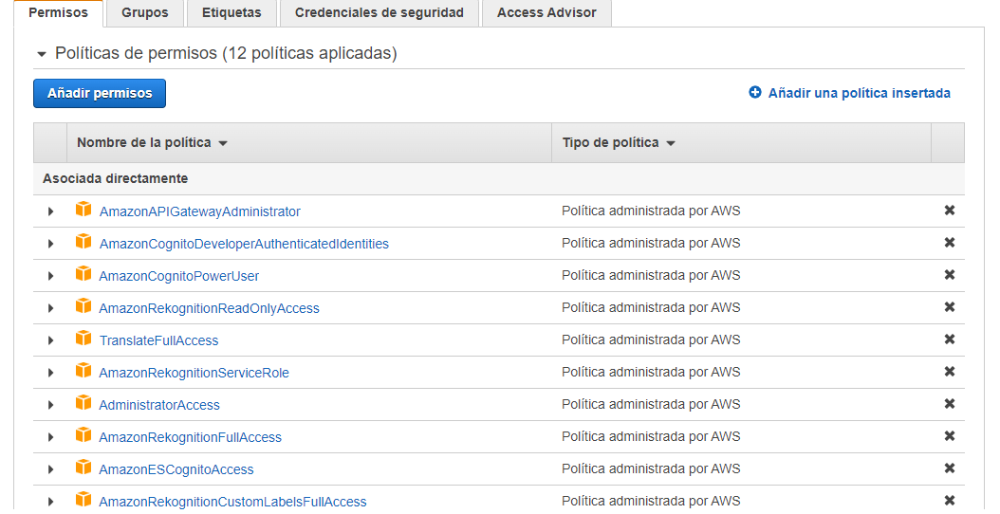
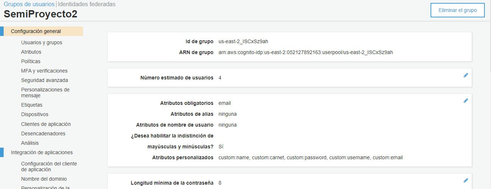
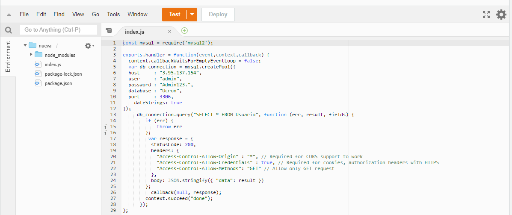
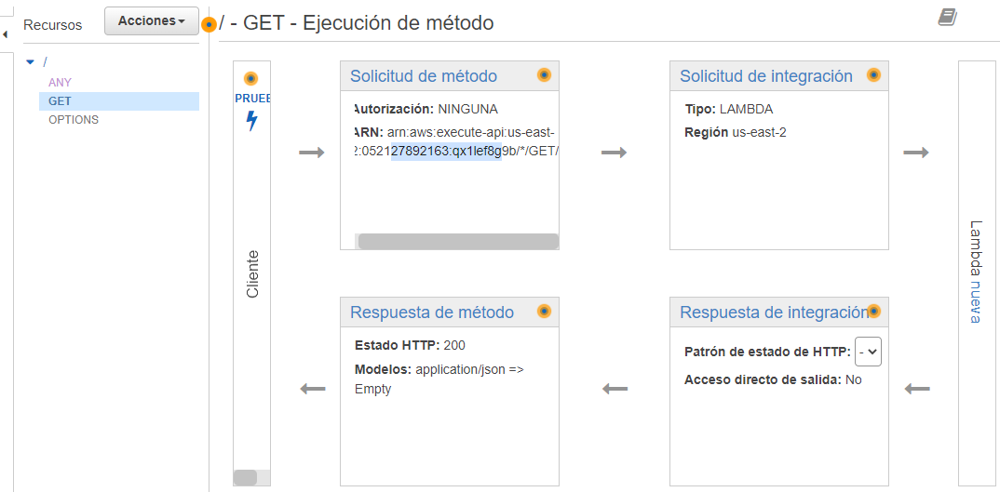

# Semi1-Grupo4-Proyecto2
# Manual de Configuracion
>-Arquitectura : para la implemtacion del proyecto se uso lo que fue docker y docker-compose, nodejs para el backend y angular para el frontend

     

>- Para poder levantar los servicios tanto del backend como frontend se uso docker-compose

     

>- - Para la Base de datos de igual forma se uso el docker-compose

     

>- - Permisos de los Usuarios

     

>- -  Cognito: Grupos de Usuario

     

>- -  Lambda: Funcion que va a retornar la lista de los usuarios

     

>- -  ApiGateway: nos dara el endpoint necesario para consumir nuestra funcion lambda

     

